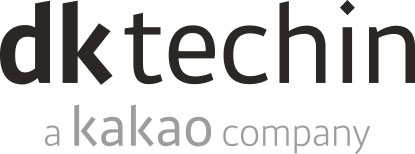

# lsy_dktechin_study

디케이테크인 채용확정형 교육 MSA 기반 Full-stack 개발자 양성 과정을 수강하며 배운 내용을 정리합니다.

---

## :books:STACKS
   <!--  

 -->

---

## :computer:CURRICULUM
  ### 컴퓨터 기초

| 과목           | 수강기간   | TIL |
| ------------ | ------ | --- |
| 리눅스          | 230227 | :heavy_check_mark:     |
| 네트워크         | 230228 | :hourglass_flowing_sand:     |
| SQL & noSQL  | 230302 | :heavy_check_mark:    |
| Git & GitHub | 230303 | :heavy_check_mark:
### 자바
   
| 과목       | 수강기간            | TIL |
| -------- | --------------- | --- |
| Java 기초  | 230306 - 230310 | :heavy_check_mark:    |
| Java OOP | 230313 - 230317 | :heavy_check_mark:     |
| Java API | 230320 -        | :hourglass_flowing_sand:
<!-- - DB와 SQL
- JDBC
- Web Client - HTML5, CSS3, JavaScript(AJAX)
- MVC 기반의 Servlet&JSP
---------------- 게시판 구현 실습
- Spring FW(DI, MVC, Rest, JdbcTemplate)
------------------------------ 1차 미니 프로젝트
- JPA
- Spring Boot (AOP, Security, Data JPA)
- Vue.js & Node.js
------------------------------ 2차 미니 프로젝트
Docker 를 활용한 컨테이너 기반 웹 애플리케이션 구현(MSA)
클라우드 기반 운영 환경 - 쿠버네티스, CICD
------------------------------ 최종 프로젝트 -->

---

