# SQL 자율 실습
## 자율실습1
1. edudb에 존재하는 모든 테이블의 리스트를 출력하시오.  
    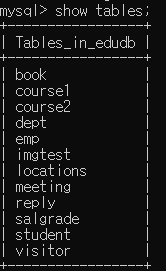
2. emp 테이블과 dept 테이블의 구조를 출력하시오.  
    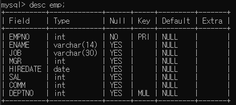 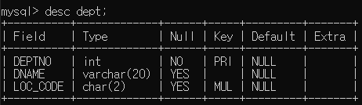
3. 사원(emp)테이블에서 모든 데이터를 출력하시오.  
    
4. 사원테이블에서 사원번호, 사원이름, 월급을 출력하시오.    
    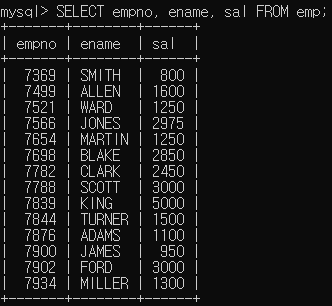
5. 사원테이블에서 직무열만 뽑는데 중복된 데이터가 없게 출력하시오.  
   - DISTINCT 사용  
    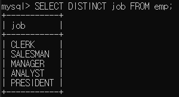
   - GROUP BY    
     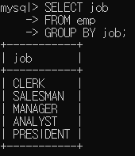
     > 찾아보니 속도가 GROUP BY를 사용하여 중복을 제거하는 것이 속도가 좀 더 좋다고 함
6. 사원테이블에서 사원이름과 월급을 출력하는데 각각의 컬럼명을 "이 름","월 급"으로 바꿔서 출력하시오. 단, ALIAS에 공백 추가  
    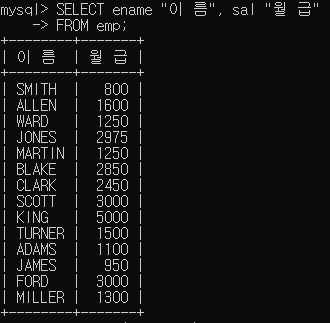
7. 사원테이블에서 사원이름, 월급을 뽑고, 월급과 커미션을  더한 값을 출력하는데 컬럼명을 '실급여'이라고 해서 출력하시오. 단, 커미션이 정해지지 않은 사람제외  
    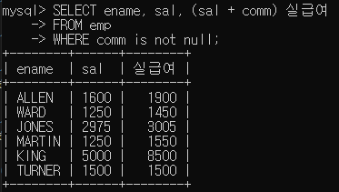
8. 사원테이블에서 'FORD'이라는 사원의 사원번호, 이름, 월급을 출력하시오.  
    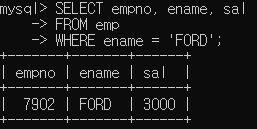
9. 사원테이블에서 직무가 'SALESMAN'인 사원의 사원번호, 이름, 직무를 출력하시오.  
    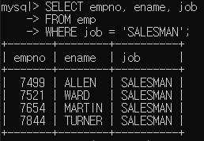
10. 사원테이블에서 사원번호가 7499, 7521, 7654인 사원의 사원번호, 이름, 월급을 출력하시오.(두 개의 SQL 명령 작성(비교+논리 연산자, in 연산자)  
    - 비교+논리 연산자  
    
    - IN 연산자  
    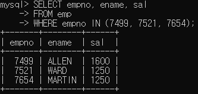
11. 사원테이블에서 월급이 1500에서 3000사이인 사원의 사원번호, 이름, 월급을 출력하시오.(두 개의 SQL 명령 작성(비교+논리 연산자, between~and 연산자)
    - 비교+논리 연산자  
    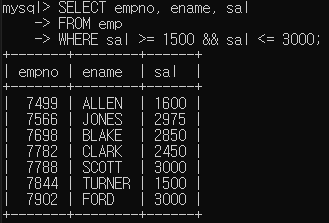
    - BETWEEN ~ AND 연산자  
    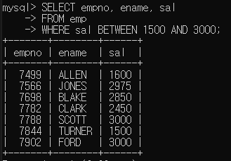
12. 사원 테이블에서 매니저가 없는 직원의 이름을 출력하시오.  
    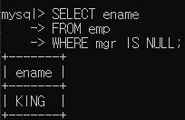
13. 사원테이블에서 월급이 많은 순으로 모든 정보를 출력하시오.
    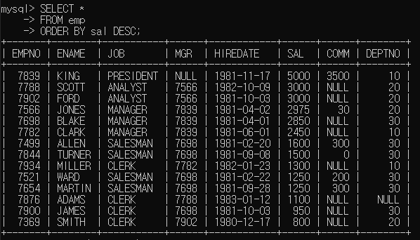
14. 사원테이블에서 직원의 이름과 입사일을 출력하는데 최근에 입사한 순으로 출력하시오.
    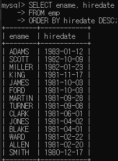
15. 사원 테이블에서 30번 부서에 근무하는 직원들의 이름과 입사년월일을 출력하는데 입사한지 오래된 순으로 출력하시오.
    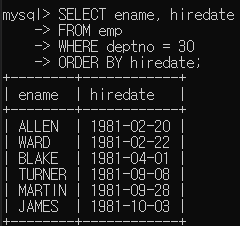
16. 이름에 'A' 가 들어간 직원들의 이름과 입사년월일을  출력하시오.
    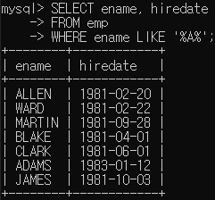
17. 이름이 'S' 로 끝나는 직원들의 이름과 직무를  출력하시오.
    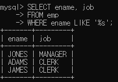
## 자율 실습2
 1. 사원 테이블에서 사원이름을 소문자로 출력하고 컬럼명을 사원이름으로 설정하시오.

 2. 사원테이블에서 사원이름과 사원 이름의 두번째 글자부터 다섯번째까지, 앞에서 2개, 뒤에서 3개를 출력하시오.

 3. 사원테이블의 사원 이름의 문자 개수를 출력하시오. 컬럼명은 '사원명 문자갯수'

 4. 사원테이블에서 사원 이름의 앞 글자 하나와 마지막 글자 하나만 출력하되 모두 소문자로 각각 출력하시오.
 
 5. 3456.78을 반올림하여 소수점 아래 첫번째 자리 까지만 나타내시오.
   
 6. 월급에 50를 곱하고 십단위는 절삭하여 출력하는데 월급뒤에 '원'을 붙이고 천단위마다 ','를 붙여서 출력한다.

 7. 직원 이름과 커미션 설정 여부를 출력하는데 설정되었으면 커미션 값을 설정되지 않았으면 '미정'을 출력하시오.

 8. 직원 이름과 커미션 설정 여부를 출력하는데 설정되었으면 '설정됨'을 설정되지 않았으면 '설정안됨'을 출력하시오.

 9. 직원 이름과 부서번호 그리고 부서번호에 따른 부서명을 출력하시오 부서가 없는 직원은 '없당' 을 출력하시오.
 (부서명 : 10 이면 'A 부서', 20 이면 'B 부서', 30 이면 'C 부서')

 10. 오늘날짜와 오늘날짜에서 10일을 더한 날짜를 출력하시오.

 11. 현재 시간을 "....년 ..월 ..일 ..시 ..분" 으로 출력하시오. 컬럼명은 '현재시간'으로 설정한다.

 12. 직원의 이름, 월급여, 연봉을 조회하는 질의를 작성하시오. (단, 직원의 연봉은 200의 월 보너스를 포함하여 계산합니다.)

 13. 다음과 같이 급여가 0~1000이면 'A', 1001~2000이면 'B' 2001~3000이면 'C', 3001~4000이면 'D', 4001이상이면 'E'를 '코드'라는 열에 출력한다.

 14. 이름의 두번째 문자가 “A”인 모든 직원의 이름을 조회하는 질의를 작성하시오.
 (두 개의 SELECT 명령을 작성하는데 하나는 like 연산자를 다른 하나는 함수로 해결하시오)
 
 15. 모든 직원의 이름과 현재까지의 입사기간을 월단위로 조회하는 질의를 작성하시오

 16. 사원테이블에서 사원이름과 사원들의 오늘 날짜까지의 근무일수를 구하시오.

 17. 1981년도에 입사한 직원들의 이름, 직무 그리고 입사일을 입사한 순으로 출력하시오.

 18. 내생일을 기준으로 요일을 출력하는 SQL  명령을 작성하시오.(요일을 숫자로)

 19. 내생일을 기준으로 요일을 출력하는 SQL  명령을 작성하시오.(요일을 요일명으로)

 20. 현재를 기준으로 내가 태어난지 몇 개월 되었는지 알 수 있는  SQL 명령을 작성하시오.

 21. 사원테이블에서 이름의 첫글자가 A이고 마지막 글자가 N이 아닌 사원의 이름을 출력하시오.

 22. 평균급여보다 많은 급여를 받는 직원들의 직원번호, 이름, 월급을 출력하되, 월급이 높은 사람 순으로 출력한다.

 23. 30번 부서의 직원들과 동일한 해에 입사한 직원들의 이름, 월급, 부서번호 그리고 입사년도를 출력한다.(30번부서 제외하고) 또한 월급을 적게 받는 순으로 출력한다.     
 
 24. 'BLAKE'와 같은 부서에 있는 직원들의 이름과 입사일을 뽑는데 'BLAKE'는 빼고 출력한다. 

 25. 이름에 'T'를 포함하고 있는 직원들과 같은 부서에서 근무하고 있는 직원의 직원번호와 이름을 출력한다.(출력 순서 무관)

 26. 급여가 평균급여보다 많고,이름에 S자가 들어가는 직원과 동일한 부서에서 근무하는 모든 직원의 직원번호,이름 및 급여를 출력하시오.(출력 순서 무관)

 27. 30번 부서에 있는 직원들 중에서 가장 많은 월급을 받는 직원보다
   많은 월급을 받는 직원들의 이름, 부서번호, 월급을 출력한다. 
   (단, ALL 또는 ANY 연산자를 사용할 것)

 28. SALES 부서에서 일하는 직원들의 부서번호, 이름, 직업을 출력한다.

 29. 'KING'에게 보고하는 모든 직원의 이름과 입사날짜를 출력한다. 
     (KING에게 보고하는 직원이란 mgr이 KING인 직원을 의미함) 

 30. 이름의 글자 갯수가 5 초과인 직원들의 정보만 출력한다.
