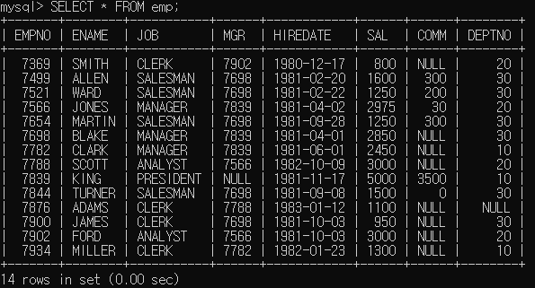

# SQL 자율 실습
## 자율실습1
1. edudb에 존재하는 모든 테이블의 리스트를 출력하시오.  
    
2. emp 테이블과 dept 테이블의 구조를 출력하시오.
     
3. 사원(emp)테이블에서 모든 데이터를 출력하시오.
    
4. 사원테이블에서 사원번호, 사원이름, 월급을 출력하시오.  
    
5. 사원테이블에서 직무열만 뽑는데 중복된 데이터가 없게 출력하시오.
   - DISTINCT 사용  
    
   - GROUP BY    
     
     > 찾아보니 속도가 GROUP BY를 사용하여 중복을 제거하는 것이 속도가 좀 더 좋다고 함
6. 사원테이블에서 사원이름과 월급을 출력하는데 각각의 컬럼명을 "이 름","월 급"으로 바꿔서 출력하시오. 단, ALIAS에 공백 추가  
    
7. 사원테이블에서 사원이름, 월급을 뽑고, 월급과 커미션을  더한 값을 출력하는데 컬럼명을 '실급여'이라고 해서 출력하시오. 단, 커미션이 정해지지 않은 사람제외  
    
8. 사원테이블에서 'FORD'이라는 사원의 사원번호, 이름, 월급을 출력하시오.  
    
9. 사원테이블에서 직무가 'SALESMAN'인 사원의 사원번호, 이름, 직무를 출력하시오.  
    
10. 사원테이블에서 사원번호가 7499, 7521, 7654인 사원의 사원번호, 이름, 월급을 출력하시오.(두 개의 SQL 명령 작성(비교+논리 연산자, in 연산자)  
    - 비교+논리 연산자  
    
    - IN 연산자  
    
11. 사원테이블에서 월급이 1500에서 3000사이인 사원의 사원번호, 이름, 월급을 출력하시오.(두 개의 SQL 명령 작성(비교+논리 연산자, between~and 연산자)
    - 비교+논리 연산자  
    
    - BETWEEN ~ AND 연산자  
    
12. 사원 테이블에서 매니저가 없는 직원의 이름을 출력하시오.

13. 사원테이블에서 월급이 많은 순으로 모든 정보를 출력하시오.

14. 사원테이블에서 직원의 이름과 입사일을 출력하는데 최근에 입사한 순으로 출력하시오.

15. 사원 테이블에서 30번 부서에 근무하는 직원들의 이름과 입사년월일을 출력하는데 입사한지 오래된 순으로 출력하시오.

16. 이름에 'A' 가 들어간 직원들의 이름과 입사년월일을  출력하시오.

17. 이름이 'S' 로 끝나는 직원들의 이름과 직무를  출력하시오.

## 자율 실습2