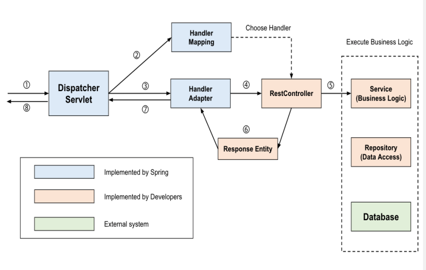

# 230510_Spring_day9
## 목차
<!-- TOC -->

- [230510\_Spring\_day9](#230510_spring_day9)
  - [목차](#목차)
  - [DispatcherServlet의 동작 과정](#dispatcherservlet의-동작-과정)
  - 
  - [Spring Boot 로깅](#spring-boot-로깅)
    - [SLF4J](#slf4j)
    - [LogBack](#logback)

<!-- /TOC -->
---
## DispatcherServlet의 동작 과정

---
## Spring Boot 로깅
- 스프링은 Log4J를 default로 제공했으나 보안문제로 인해 LogBack으로 이동함
### SLF4J
- 스프링 부트에 내장된 API
- 로그 기능을 제공
- 개발자가 기술과 관련된 어떠한 이슈에 * 관심을 갖고 파악하려고 하는 자세를 가진다는 의미로 보여질 수 있음
### LogBack
- 로깅을 수행하기 위해 필요한 주요 설정 요소
  - Logger, Appender, Encoder
- ERROR: 요청을 처리하는 중 오류가 발생
- WARN : 처리 가능한 문제 향후 시스템 에러의 원인이 될 수 있는 경고
- INFO : 상태 변경과 같은 정보성 로그
- DEBUG : 프로그램을 디버깅 하기 위한 정보를 표시
- TRACE : Debug 보다 훨씬 상세한 정보를 표시