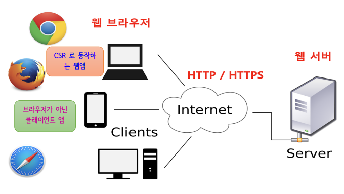

# 230519_Spring_day15
## 목차
---
## REST
"REpresentational State Transfer"의 약어
- 왜 REST 기술이 나왔는지 깊이 있게 봐야함
- 하나의 URI가 하나의 고유한 Resorce를 대표하도록 설계된다는 개념 
- **자원을 이름으로 구분하여 해당 자원의 상태를 주고 받는 모든 것**
- 네트워크 아키텍처 원리의 모음
  - 자원을 정의하고 자원에 대한 주소를 지정하는 방법 전반
- 분산 하이퍼미디어 시스템을 위한 소프트웨어 개발 아케틱처의 한 형식
- HTTP 프로토콜을 그대로 활용
  - 웹의 장점을 최대한 활용
- Client와 Server 사이의 통신 방식 중 하나
### 적용
- **HTTP URI를 통해 자원을 명명**하고 **HTTP Method(POST, GET, PUT, DELETE)를 통해 해당 자원에 대한 CRUD 작업을 적용**

| CRUD           | Operation        | Method |
| -------------- | ---------------- | ------ |
| Create         | 생성             | POST   |
| Read           | 조회             | GET    |
| Update         | 수정             | PUT    |
| Partial Update | 부분수정         | PATCH  |
| Delete         | 삭제             | DELETE |
| HEAD           | header 정보 조회 | HEAD   |

REST -> 자원의 이름으로 구분하여 해당 자원의 상태를 주고 받는 모든것
### REST가 필요한 이유
- 애플리케이션 분리 및 통합
- Web을 기반으로 하는 C&S 환경의 다양한 프로그램 개발
- 다양한 클라이언트의 등장

### REST 특징
- 1~4번은 웹 기반이기에 가질 수 밖에 없는 특징
1. Server-Client(서버-클라이언트 구조)
   - 자원이 있는 쪽이 Server, 자원을 요청하는 쪽이 Client
2. Stateless(무상태)
3. Cacheable(캐시 처리 기능)
4. Layered System(계층화)
5. Code-On-Demand(optional)
6. Uniform Interface(인터페이스 일관성)

### application/hal+json
- json 전달 시 상품의 리스트만 보여주는게 아니고 상품의 상세정보를 담고 있는 url도 함께 전달할 때 사용
---
## REST API
- REST 아키텍처 스타일을 따르는 API
- 사용자가 어떠한 요청을 했을 때 HTML을 리턴하지 않고, 사용자가 필요로 하는 결과만을 리턴해주는 방식
- 마이크로 서비스(하나의 큰 애플리케이션을 여러 개의 작은 애플리케이션으로 쪼개어 변경, 조합이 가능하도록 만든 아키텍처)를 제공하는 업체 대부분이 REST API
### 특징
### 설계 기본 규칙
### API 디자인 가이드
### URI 설계 시 주의할 점
### 리소스 간 관계 표현 방법
### Collection과 Document

---

## HTTP 응답 상태코드
[HTTP 응답 상태코드를 정리한 DOCS](https://docs.spring.io/spring-framework/docs/current/javadoc-api/org/springframework/http/HttpStatus.html)

---
## Spring Rest API 구현 관련 애노테이션

---
## `@ResponseBody` 와 `ResponseEntity`