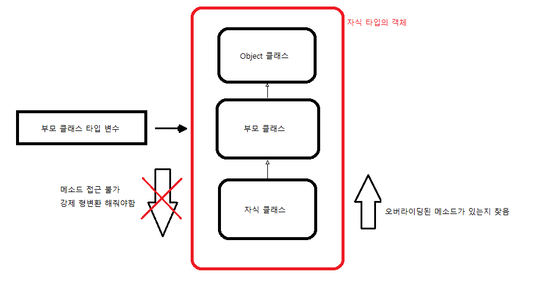

# 230316 Java Day 9

## 목차
<!-- TOC -->

- [Java Day 9](#java-day-9)
    - [목차](#%EB%AA%A9%EC%B0%A8)
    - [싱글톤패턴](#%EC%8B%B1%EA%B8%80%ED%86%A4%ED%8C%A8%ED%84%B4)
        - [싱글톤 패턴 생성 방법](#%EC%8B%B1%EA%B8%80%ED%86%A4-%ED%8C%A8%ED%84%B4-%EC%83%9D%EC%84%B1-%EB%B0%A9%EB%B2%95)
    - [abstract class](#abstract-class)
    - [인터페이스 *Interface*](#%EC%9D%B8%ED%84%B0%ED%8E%98%EC%9D%B4%EC%8A%A4-interface)
        - [인터페이스 생성](#%EC%9D%B8%ED%84%B0%ED%8E%98%EC%9D%B4%EC%8A%A4-%EC%83%9D%EC%84%B1)
        - [인터페이스 사용](#%EC%9D%B8%ED%84%B0%ED%8E%98%EC%9D%B4%EC%8A%A4-%EC%82%AC%EC%9A%A9)
        - [인터페이스 타입 변환](#%EC%9D%B8%ED%84%B0%ED%8E%98%EC%9D%B4%EC%8A%A4-%ED%83%80%EC%9E%85-%EB%B3%80%ED%99%98)
            - [자동 형 변환](#%EC%9E%90%EB%8F%99-%ED%98%95-%EB%B3%80%ED%99%98)
            - [강제 형 변환](#%EA%B0%95%EC%A0%9C-%ED%98%95-%EB%B3%80%ED%99%98)
        - [부모 타입의 변수에 자식 타입의 객체를 할당하면...](#%EB%B6%80%EB%AA%A8-%ED%83%80%EC%9E%85%EC%9D%98-%EB%B3%80%EC%88%98%EC%97%90-%EC%9E%90%EC%8B%9D-%ED%83%80%EC%9E%85%EC%9D%98-%EA%B0%9D%EC%B2%B4%EB%A5%BC-%ED%95%A0%EB%8B%B9%ED%95%98%EB%A9%B4)
    - [오늘의 Tip](#%EC%98%A4%EB%8A%98%EC%9D%98-tip)
        - [String.format](#stringformat)
        - [java.util.Random](#javautilrandom)
        - [클래스 다이어그램](#%ED%81%B4%EB%9E%98%EC%8A%A4-%EB%8B%A4%EC%9D%B4%EC%96%B4%EA%B7%B8%EB%9E%A8)

<!-- /TOC -->

---

## 싱글톤패턴
- JVM 내에 1개의 클래스 인스턴스만을 갖도록 보장하고, 이에 대한 전역 접근점을 제공하는 패턴
- 생성자 private -> new로 객체 생성 불가
- 생성자 메서드로 객체를 1개만 만들게 설정할 수 없음
  - 생성자 메서드는 객체를 만드는 메서드가 아니라 만들어진 메서드를 초기화하는 메서드이기때문
- 팩토리 메서드
  - 생성자 메서드가 안보인다면 객체 생성을 대신해주는 static 메서드가 있을것이다
### 싱글톤 패턴 생성 방법
1.  클래스로딩 시 객체 생성하여 팩토리 메서드 호출 시 return
```java
class MySingleton {
	// 메모리상에 로딩될때 MySingleton 객체를 미리 생성 --> 구현하기 나름	
	private static MySingleton obj = new MySingleton();
	private MySingleton() {		
	}
	
	
	
	static MySingleton getMy() {
		// 미리 생성한 객체를 return
		return obj;
	}
```
2. 클래스로딩 시에는 객체를 생성하지않고 팩토리 메서드 호출 시 생성하여 return
```java 
// 클래스 로딩시 객체 생성을 하지 않고
	private static MySingleton2 obj = null;
	private MySingleton2() {		
	}
	static MySingleton2 getMy() {
		// getMy 호출 시 객체 생성하여 return
		if (obj == null)
			obj = new MySingleton2();
		
		// 생성한 객체를 return
		return obj;
	}
```
---

## abstract class
- 서로 다른 클래스를 하나의 타입으로 묶는 class를 abstract class로 만든다.
- 각 클래스들에게 공통의 멤버변수가 있다면 abstract class의 변수로 변경


---

## 인터페이스 *Interface*
> 인터페이스는 ***껍데기***다
- 클래스의 특별한 형태, 클래스의 변형이다.
- 각 클래스가 is a 관계를 성립하지않으나 그들으 같은 타입으로 묶고자 할 때 사용한다.
- abstract class와 많은 부분이 비슷함
  - 인터페이스 객체 생성은 불가능
  - abstract method가 0개 이상 있을 수 있음  
  - 상속 가능

- 인터페이스는 다중 상속이 가능
  - 인터페이스 생성 시 2개 이상의 인터페이스 상속 가능
  - 인터페이스를 상속하는 클래스 구현 시 여러 인터페이스를 설정 가능
  - 클래스 생성 시 하나의 클래스를 상속할 때 다른 인터페이스를 상속하는데에는 제한이 없음
  - extends 키워드 뒤에 상속할 인터페이스명을 나열하면 됨
- *abstract class보다 인터페이스의 사용 빈도가 훨씬 높음*

### 인터페이스 생성
```java
interface interface1 [extends 부모인터페이스, ...]{ //인터페이스 헤더
    //인터페이스 바디
    public static final 타입 변수명 = 초기화값;

    abstract 메서드;

    //JDK8부터
    static 메서드;
    default 메서드;
}
```
- 인터페이스는 일반 변수를 가질 수 없음
- 명시적 초기화를 하고 있는 상수 변수만 가질 수 있음
  - 명시적 초기화 : 변수 선언 시 대입연산자를 갖는것
- 인터페이스 내 정의된 상수는 제어자가 반드시 public static final 
  - 만약 제어자를 설정하지 않으면 자바 컴파일러가 자동으로 고정시킴
  - static 메모리 공간 고정, final 값 고정
- 원래 인터페이스에는 abstract 메서드만 있을 수 있었음
- JDK8부터 인터페이스 내에서 필요하면 static 메서드, default 메서드 정의 가능하게 변경됨

### 인터페이스 사용
```java
class 클래스명 implements 부모인터페이스, ... {}
```
- implements 절을 사용
- 상속받는 부모 클래스나 부모 인터페이스에 abstract method가 있다면 모두 Overriding 해야함 


### 인터페이스 타입 변환

#### 자동 형 변환
```java
interface A{};

public class B implements A{};
public class C implements A{};

public class D extends B{};
public class E extends C{};
```
- 위와 같은 관계의 클래스와 인터페이스가 있다고 할 때
- 인터페이스 객체와 클래스 객체 사이에 자동 형 변환이 일어난다.
```java
B b = new B();
C c = new C();
D d = new D();
E e = new E();

A a;
a = b;
a = c;
a = d;
a = e;
```
- 모든 객체가 인터페이스를 직, 간접적으로 구현하고 있기 때문
- 객체가 인터페이스 타입으로 자동 변환되면 인터페이스에 선언된 메소드만 사용이 가능

#### 강제 형 변환
- 부모 클래스의 객체나 인터페이스 타입으로 자동변환된 객체는 자식 클래스의 메소드를 사용할 수 없음.
- 사용하려면 캐스팅 기호를 사용하여 강제 형 변환을 해야함.
- 강제형변환 방법은 두가지가 있다. 접근 시 매번 형 변환을 하는 경우, 객체를 선언하는 경우
- 접근 시 매번 형변환을 하는 경우
```Java
class A {};

class B extends A {
    void printB(){
        System.out.println("B");
    }
}

A a = new A();
// 직접 접근하여 형변환
((B)a).printB();
```
- 객체를 선언하는 경우
```java
class A {};

class B extends A{
    void printB(){
        System.out.println("B");
    }
}
// 부모 클래스 a 생성
A a = new A();

// B클래스 타입의 b 변수에 강제 타입 변환
B b = (B) a;

b.printB();
```
- 두 경우의 사용 결과는 동일하나 메모리 상에서의 구조는 다름
- 스택 메모리 상에 변수가 할당됨

### 부모 타입의 변수에 자식 타입의 객체를 할당하면...

- 부모 클래스 타입의 변수에 자식 타입의 객체를 할당하면 그 변수는 자식 타입에서 새롭게 생성한 메소드에 접근 권한이 없다.

- 만약 최상위 클래스의 메소드가 호출된다면 자식 타입의 객체를 할당했기때문에 자식 타입의 객체와 연관관계를 맺는 모든 클래스에서 최하위단부터 오버라이딩된 내용이 있는지 확인하고 있다면 그 내용을 없다면 최상위 클래스의 메소드의 내용을 사용한다.

---

## 오늘의 Tip

### String.format
- System.out.printf()와 동일
```java
int hour, minute, second;
String.format("%d시 %d분 %d초", hour, minute, second)
```

### java.util.Random
- 난수 생성 기능을 제공하는 Random class

### 클래스 다이어그램
- 실선은 클래스 상속, 점선은 인터페이스 상속