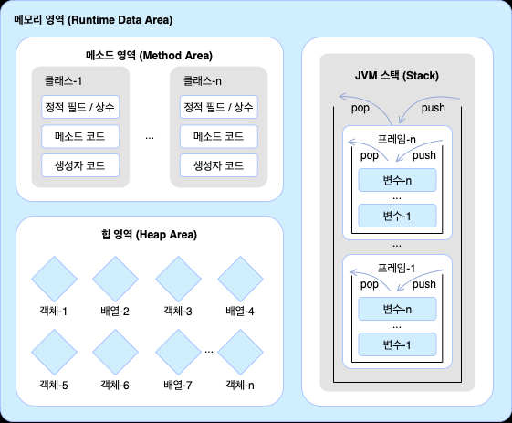
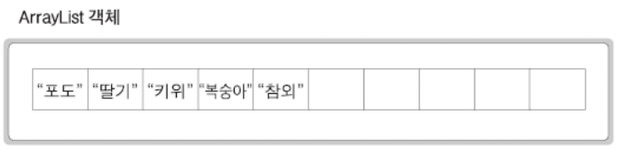
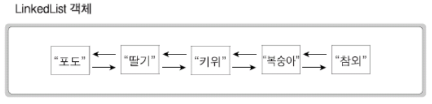
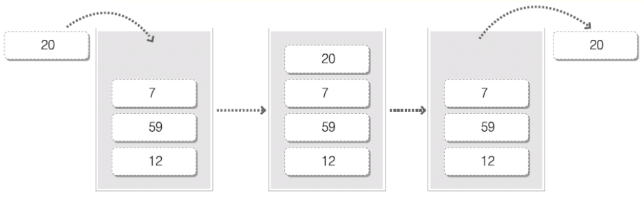
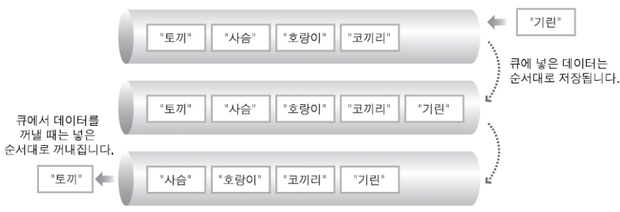

# 230320 Java Day 11
## 목차

<!-- TOC -->

- [Java Day 11](#java-day-11)
    - [목차](#%EB%AA%A9%EC%B0%A8)
    - [참조타입](#%EC%B0%B8%EC%A1%B0%ED%83%80%EC%9E%85)
        - [데이터 타입 분류](#%EB%8D%B0%EC%9D%B4%ED%84%B0-%ED%83%80%EC%9E%85-%EB%B6%84%EB%A5%98)
            - [기본 타입](#%EA%B8%B0%EB%B3%B8-%ED%83%80%EC%9E%85)
            - [참조 타입](#%EC%B0%B8%EC%A1%B0-%ED%83%80%EC%9E%85)
        - [**메모리 사용 영역**](#%EB%A9%94%EB%AA%A8%EB%A6%AC-%EC%82%AC%EC%9A%A9-%EC%98%81%EC%97%AD)
            - [메소드 영역](#%EB%A9%94%EC%86%8C%EB%93%9C-%EC%98%81%EC%97%AD)
            - [힙 영역](#%ED%9E%99-%EC%98%81%EC%97%AD)
            - [스택 영역](#%EC%8A%A4%ED%83%9D-%EC%98%81%EC%97%AD)
        - [참조 타입 변수의 등가 연산](#%EC%B0%B8%EC%A1%B0-%ED%83%80%EC%9E%85-%EB%B3%80%EC%88%98%EC%9D%98-%EB%93%B1%EA%B0%80-%EC%97%B0%EC%82%B0)
        - [null과 NullPointException](#null%EA%B3%BC-nullpointexception)
            - [null](#null)
            - [NullPointException](#nullpointexception)
        - [String](#string)
            - [문자열 비교](#%EB%AC%B8%EC%9E%90%EC%97%B4-%EB%B9%84%EA%B5%90)
            - [문자 추출](#%EB%AC%B8%EC%9E%90-%EC%B6%94%EC%B6%9C)
            - [문자열 길이](#%EB%AC%B8%EC%9E%90%EC%97%B4-%EA%B8%B8%EC%9D%B4)
            - [문자열 대체](#%EB%AC%B8%EC%9E%90%EC%97%B4-%EB%8C%80%EC%B2%B4)
            - [문자열 분리](#%EB%AC%B8%EC%9E%90%EC%97%B4-%EB%B6%84%EB%A6%AC)
        - [배열](#%EB%B0%B0%EC%97%B4)
            - [배열 복사](#%EB%B0%B0%EC%97%B4-%EB%B3%B5%EC%82%AC)
            - [열거 타입 Enum](#%EC%97%B4%EA%B1%B0-%ED%83%80%EC%9E%85-enum)
    - [패키지](#%ED%8C%A8%ED%82%A4%EC%A7%80)
    - [Wrapper class 포장 클래스](#wrapper-class-%ED%8F%AC%EC%9E%A5-%ED%81%B4%EB%9E%98%EC%8A%A4)
    - [StringBuffer](#stringbuffer)
        - [StringBuffer에서 비교](#stringbuffer%EC%97%90%EC%84%9C-%EB%B9%84%EA%B5%90)
    - [제네릭generic 구문](#%EC%A0%9C%EB%84%A4%EB%A6%ADgeneric-%EA%B5%AC%EB%AC%B8)
        - [클래스 생성](#%ED%81%B4%EB%9E%98%EC%8A%A4-%EC%83%9D%EC%84%B1)
        - [객체 생성](#%EA%B0%9D%EC%B2%B4-%EC%83%9D%EC%84%B1)
        - [Generic 클래스들](#generic-%ED%81%B4%EB%9E%98%EC%8A%A4%EB%93%A4)
    - [Collection API](#collection-api)
        - [자료 구조](#%EC%9E%90%EB%A3%8C-%EA%B5%AC%EC%A1%B0)
        - [리스트 클래스](#%EB%A6%AC%EC%8A%A4%ED%8A%B8-%ED%81%B4%EB%9E%98%EC%8A%A4)
            - [ArrayList](#arraylist)
            - [LinkedList](#linkedlist)
            - [**iterator 메소드**](#iterator-%EB%A9%94%EC%86%8C%EB%93%9C)
        - [스택](#%EC%8A%A4%ED%83%9D)
            - [LinkedList](#linkedlist)
        - [큐](#%ED%81%90)
            - [LinkedList](#linkedlist)
        - [해쉬 테이블](#%ED%95%B4%EC%89%AC-%ED%85%8C%EC%9D%B4%EB%B8%94)
            - [HashMap](#hashmap)
        - [집합](#%EC%A7%91%ED%95%A9)
            - [HashSet](#hashset)
    - [오늘의 Tip](#%EC%98%A4%EB%8A%98%EC%9D%98-tip)
        - [문자열 작성 시 기호](#%EB%AC%B8%EC%9E%90%EC%97%B4-%EC%9E%91%EC%84%B1-%EC%8B%9C-%EA%B8%B0%ED%98%B8)

<!-- /TOC -->
---
## 참조타입
### 데이터 타입 분류
#### 기본 타입
- 정수 타입
  - byte, char, short, int, long
- 실수 타입
  - float
  - double
- 논리 타입
  - boolean
#### 참조 타입
- 객체들의 주소를참조하는 타입
- 배열, 열거, 클래스, 인터페이스 타입
- 기본 타입으로 선언된 변수는 값 자체를 저장하지만, 참조 타입으로 선언된 변수는 객체가 생성된 메모리 주소를 저장
---
### **메모리 사용 영역**
- JVM 구동시 JVM이 운영체제에서 할당받은 메모리영역을 아래처럼 구분해서 사용

#### 메소드 영역
- 로딩된 클래스의 메소드 코드가 저장, 바이트 코드 파일의 내용이 저장되는 영역
- 클래스 변수의 공간이 만들어지는 영역, 여러 객체에서 공유됨
  - 상수, 정적필드(static 메소드들), 메소드 코드, 생성자 코드 등
- 프로그램 수행이 끝날 때 까지 고정되는 영역
#### 힙 영역
- 프로그램 상에서 데이터를 저장하기 위해 **동적으로 할당**하여 쓸 수 있는 메모리 영역 클래스의 **인스턴스**가 만들어지는 영역
- 여러 스레드들이 공유하는 영역
#### 스택 영역
- 메소드가 호출될 때마다 데이터 영역 생성 - 스택 프레임
- 스택 프레임이 쌓여 스택을 구성
- 메소드 정보, 로컬변수, 매개변수, 연산 중 발생하는 임시데이터 등이 저장
- 메소드가 수행되는 동안 필요로 되는 변수들을 스택에 저장
- 메소드 실행이 끝나면 스택 반환
- 스레드별로 각각의 스택 영역
---
### 참조 타입 변수의 등가 연산
- 같은 참조 값을 갖는지 비교하는 것
  - 하나의 객체를 공유하는지 확인하는 것
---
### null과 NullPointException
#### null
- null 값: 참조 변수는 아직 주소를 저장하고 있지 않다는 뜻
- null도 초기값으로 사용할 수 있기에 null로 초기화된 참조 변수는 스택 영역에 생성
#### NullPointException
- 변수가 null인 상태에서 객체의 데이터나 메소드를 사용하려 할 때 발생하는 예외
- 참조 변수가 객체를 정확히 참조하도록 주소를 대입해야 해결됨
---
### String
- 문자열 데이터를 다룰 때 사용하는 변수
- 문자열 타입은 참조형 변수임 == 객체로 취급
  - 문자열 리터럴이 Java에서는 객체로 취급되는 것
- String 객체는 한번 생성된 후 값을 바꿀 수 없음
#### 문자열 비교
- 문자열 리터럴이 동일하다면 String 객체를 공유
  - 객체를 하나만 생성하여 공유
  - 이 경우 == 연산자를 사용해도 true값이 나옴
- 서로 다른 객체인 경우 등가 연산을 사용할 수 없음
  - 어떤 API를 사용해서 문자열을 받는다면 대부분 새로운 객체를 생성해서 반환
  - 등가 연산을 사용할 수 없는 경우가 많음
- 그래서 String.equals()를 사용하는 것
```java
String name1 = "홍길동";
String name2 = "홍긴동";

boolean result1 = name1.equals(name2); //false
boolean result2 = name1.equals("홍길동"); //true
```
#### 문자 추출
```java
String subject = "자바 프로그래밍";
char charValue = subject.charAt(3);
```
- 원하는 인덱스 위치의 문자를 추출할 수 있음

#### 문자열 길이
```java
String subject = "자바 프로그래밍";
int length = subject.length();
```

#### 문자열 대체
```java
String oldStr = "자바 프로그래밍";
String newStr = oldStr.replace("자바","Java");
```
- replace를 하면 새로운 문자열 객체가 생성되는 것으로 정말 그 안에 내용이 대체되는 것은 아님
- 객체를 하나 더 만들어서 사용할 때만 써야함
  
#### 문자열 분리
```java
String board = "번호,제목,내용,성명";
String[] arr = board.split(",");
```
- 구분자를 기준으로 문자열을 분리시켜 문자열 배열에 저장
---
### 배열
#### 배열 복사
```java
System.arraycopy(Object src, int scrPos, Object dest, int destPos, int length);
// System.arraycopy(원본 배열, 복사 시작 인덱스, 새 배열, 붙여넣기 시작 인덱스, 복사 항목 수);
```
#### 열거 타입 (Enum)
- 클래스의 특별한 형태
- 상수로만 구성됨
- 데이터 중 몇 가지로 한정된 값을 갖는 경우  
  - ex) 요일, 계절
```java
public enum Week {
    MONDAY,
    TUESDAY,
    WEDNESDAY,
    THURSDAY,
    FRIDAY,
    SATURDAY,
    SUNDAY
}
```
---
## 패키지
- 클래스들을 묶는 단위, 실제로는 폴더가 됨
- 자바소스의 제일 위에 패키지 선언이 되어야 함
- 패키지화는 필수가 아님
- **패키지명.클래스명** < 형태로 사용
  - 클래스의 정식 명칭
- 패키지명.서브패키지명.클래스명
  - 여러개의 패키지를 계층 구조로 만드는 경우
- 특정 패키지의 클래스나 인터페이스 사용시 import 문으로 선언하여 사용
  - java.lang 패키지는 자동 import 
  - 프로그램이 필요로 하는 기본 API가 모여있음
- *자바가 최초로 발표될 때(Java 1, JDK 1.0) 패키지의 갯수는 몇개?*
  - 8개
---
## Wrapper class (포장 클래스)
  - 기본형 데이터를 객체로 만들 때 사용
  - java.lang 패키지에 있음  
    | Type    | Class     |
    | ------- | --------- |
    | int     | Integer   |
    | char    | Character |
    | double  | Double    |
    | boolean | Boolean   |
---
## StringBuffer
- 문자열을 읽기용도가 아니라 편집해서 사용해야할 때 사용
- 이미 만들어진 StringBuffer 객체의 내용을 변화시킴
```java
String str;
int a, b, c;

 str = "a" + a + "b" + b + "c" + c;

StringBuffer sbuffer = new StringBuffer();
sbuffer.append("a ");
sbuffer.append(a);
sbuffer.append("b ");
sbuffer.append(b);
```
### StringBuffer에서 비교
```java
 StringBuffer bf1 = new StringBuffer("가나다");
        StringBuffer bf2 = new StringBuffer();
        bf2.append("가나다");
        System.out.printf("%b\n", bf1.equals(bf2));
```
- 위 소스의 출력 결과는 false 임
- equals는 object 클래스가 가지고 있고 이를 각 클래스에서 오버라이딩해서 사용하는 것
- StringBuffer는 equals를 오버라이딩 하지 않음 => Object 클래스의 equals를 사용하게 됨
  - Object 클래스의 equals 는 등가연산과 동일함
  - 둘은 서로 다른 객체의 참조값을 가지기에 false
- 제대로 비교하려면
```java
System.out.printf("%b\n", bf1.toString().equals(bf2.toString()));
```
- toString()을 통해 사용해야함
---
## 제네릭(generic) 구문
제네릭 프로그래밍 
- 프로그램에서 처리할 데이터의 타입을 일반화 시킨다.
- 재사용성을 높이는 결과가 됨
- 클래스에서 처리할 데이터 타입을 **클래스를 만들** 때 정하는게 아니라 클래스 **객체를 생성**할 때 정하는 것
### 클래스 생성
```java
class Vaule3<T> {
	T obj;
	void put(T obj) {
		this.obj = obj;
	}
	
	T get() {
		return obj;
	}
```
- 제네릭스라는 구문이 적용되어 만들어진 클래스의 객체 생성시 타입 파라미터라는 것을 사용함
- T -> Type parameter

### 객체 생성
```java 
Value3<String> v3 = new Value3<>(); // String을 다루는 Value3형 v3
Value3<Date> v4 = new Value3<>(); // Date를 다루는 Value3형 v4
```
- 객체 생성 시 type parameter에 지정한 type으로 객체 내의 T가 전부 바뀜

### Generic 클래스들
> ArrayList<E> , LinkedList<E>, HashSet<E>
- 데이터들을 보관하고 데이터들을 하나로 묶어서 다룰 수 있는 클래스들
> HashMap<K,V>
- 데이터 저장 시 Key, Value 값으로 저장되는 데이터를 다루는 클래스
---
## Collection API
- 자료 구조 API라고도 함
### 자료 구조
- 데이터를 효율적으로 사용할 수 있도록 **구조**를 만들어서 저장해둔 것
- 자료구조의 종류
  - 리스트, 스택, 큐, 해쉬 테이블, 집합(엄밀히 말하면 자료구조가 아님)
- JDK 자료구조 클래스들
  
| 자료구조   | 클래스 이름                          |
| ------ | ------------------------------- |
| 리스트    | ArrayList, LinkedList, (Vector) |
| 스택     | LinkedList, (Stack)             |
| 큐      | LinkedList                      |
| 해쉬 테이블 | HashMap, (Hashtable)            |
| 집합     | HashSet                         |
- java.util 패키지에 속함
-  Vector, Stack, Hashtable 클래스는 사용이 권장되지 않음. 구버전부터 있던 클래스


> ArrayList, LinkedList, HashMap, HashSet
- 자바의 Collection API를 대표하는 필수 클래스
### 리스트 클래스
#### ArrayList
- 내부에 있는 배열에 데이터를 저장

- 생성 방법
```Java
ArrayList<String> list = new ArrayList<String>();
```
- 데이터 추가 방법
```Java
list.add("포도");
list.add("딸기");
list.add("복숭아");

//중간에 삽입하는 방법
list.add(2,"키위"); // 인덱스 2번에 키위를 삽입, 기존 2번의 값은 밀려남
```
- 데이터 가져오는 방법
```Java
String str = list.get(2); // 인덱스 2 위치에 있는 키위 return
```
- 데이터의 수를 가져오는 방법
```Java
int num = list.size();
```
- 데이터를 교체하는 방법
```Java
list.set(0,"오렌지");
```
- 데이터를 삭제하는 방법
```Java
list.remove(1); //인덱스로 삭제

list.remove("오렌지"); //데이터로 찾아서 삭제
```
- 데이터를 검색하는 방법
```Java
int index = list.indexOf("사과"); // 첫 사과의 위치 return

index = list.lastIndexOf("사과"); // 마지막 사과의 위치 return
```
#### LinkedList 
- 인접 데이터가 서로 가르키는 식으로 데이터를 저장

- 기본적인 사용 방법은 ArrayList와 동일함
- 데이터 추가
  - 두 번째로 add 할 때 부터 서로 연결되며 추가됨.
- LinkedList get 메소드
  - get(2)를 사용하면 인덱스 2 위치에 있는 값을 가져온다는 의미
  - 첫번째 데이터를 인덱스 0으로 삼아 0에서부터 찾기 시작
  - 비효율적임
- 데이터 삽입
  -  삽입할 위치의 링크를 끊고 새로 삽입하는 데이터와 링크를 맺으며 삽입됨
- LinkedList에서 효율적으로 데이터 찾기
  - Foreach 문이나 iterator 메소드를 사용해야함
- LinkedList는 List의 수정이 많은 경우에 사용하면 좋음, List를 그냥 읽어올땐 ArrayList
  - 둘 다 많다면 LinkedList를 사용하고 읽어올 땐 iterator 메소드 사용
#### **iterator 메소드**
- 데이터 순차 접근을 위한 메소드
- 생성 방법
```java
//생성한 list와 동일한 타입 변수를 지정하고 list의 iterator 객체를 리턴하는 메소드를 호출
Iterator<String> iterator = list.iterator();
```
- 데이터 접근
```java
// iterator 통해 리스트의 다음 값을 읽어와 str에 저장
String str = iterator.next();
```
- 예외 발생을 막는 방법
  - next()는 더 이상 데이터가 없으면 NoSuchElementException을 발생시킴
```java
while (iterator.hasNext()) { //다음 값이 있으면 true를 반환
    String str = iterator.next();
}
```

### 스택
- LIFO (Last In First Out)
- 데이터를 넣은 순서의 역순으로만 꺼낼 수 있는 자료 구조

#### LinkedList
- 스택 생성
```Java
LinkedList<Integer> stack = new LinkedList<Integer>();
```
- 데이터 삽입
```java
stack.addLast(new Integer(12));
stack.addLast(new Integer(59));
stack.addLast(new Integer(7)); // 12 - 59 - 7 순으로 저장
```
- 데이터 추출
```java
stack.getLast(); // 제일 위에 있는 7 return
```
### 큐
- FIFO (First In First Out)
- 데이터를 넣은 순서와 같은 순서로만 꺼낼 수 있는 자료 구조

#### LinkedList
- 큐 생성
```Java
LinkedList<String> queue = new LinkedList<String>();
```
- 데이터 삽입
```java
queue.offer("토끼");
queue.offer("사슴"); 
queue.offer("호랑이"); // 토끼 - 사슴 - 호랑이 순으로 저장
```
- 데이터 추출
```java
str = queue.poll(); // 제일 앞에 있는 토끼 return
```
### 해쉬 테이블
- 여러 개의 통(bucket)을 만들어 두고 키 값을 이용하여 데이터를 넣을 통 번호를 계산하는 자료구조
- Hash 구조
  - Key, Value 쌍 구조의 데이터 구조
#### HashMap
- 이미 존재하는 키, 값 쌍에 같은 이름의 키를 넣으면 오버라이딩되어 덮어씌여짐
  - 이를 원하지 않는다면 이미 존재하는 키인지 확인하는 과정이 필요함
- 기본 생성 시 16개의 bucket으로 구성된 해쉬 테이블이 생성됨
```Java
HashMap<String, Integer> hashtable = new HashMap<String, Integer>();

// bucket 개수를 늘릴려면
HashMap<String, Integer> hashtable = new HashMap<String, Integer>(100);
```
- 데이터 넣기
```Java
hashtable.put("해리",new Integer(95)); 
//키 값으로 통 번호를 계산하여 그 통에 키 값과 데이터를 넣음
```
- 데이터 찾기
```Java
int num = hashtable.get("해리"); // 키 값으로 찾는다
```
- 데이터 삭제
```Java
hashtable.remove("해리"); //키 값으로 찾아 지움
```


### 집합
#### HashSet
  - 데이터 저장 시 Hash 구조 사용
  - 중복된 값을 허용하지 않음
    - 이미 존재하는 값을 add하려고하면 아예 add 불가능
  - 순서가 없음
  - 데이터를 꺼내오는 메소드(get 등)를 제공하지않음
    - iterator나 배열로 변경해서 꺼내야함말
- 생성 방법
```Java
HashSet<String> set = new HashSet<String>();
```
- 데이터 추가 방법
```java
// 이미 있는 데이터를 추가하면 추가 되지 않는다. false
set.add("자바");
```
- 데이터 수를 가져오는 방법
```java
int size = set.size();
```
- 모든 데이터를 읽어오는 방법
  - Iterator 사용
   ```java
    Iterator<String> iterator = set.iterator();

    while(iterator.hasNext()) {
        String str = iterator.next();
        System.out.println(str);
    }
    ```
   - 배열 사용
    ```java
        for(String e: set){
            System.out.println(e); // 만약 값을 하나하나 읽어와서 다른 조작을 해야한다면 String 배열을 생성하여 값을 넣어줘야함
        }
    ```
---
## 오늘의 Tip
### 문자열 작성 시 기호
- 문자열 작성 중 " 등의 기호를 문자열 내에 사용하고 싶으면 \ 사용
```java
System.out.println("\"가나다\"를 입력했군요...");
```
