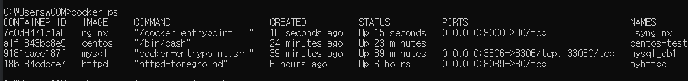
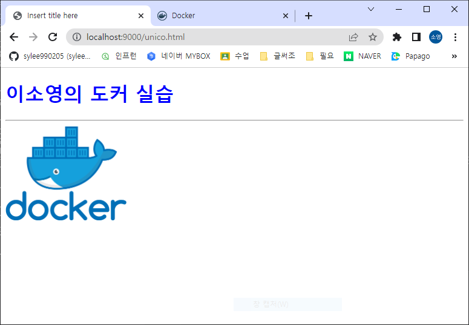
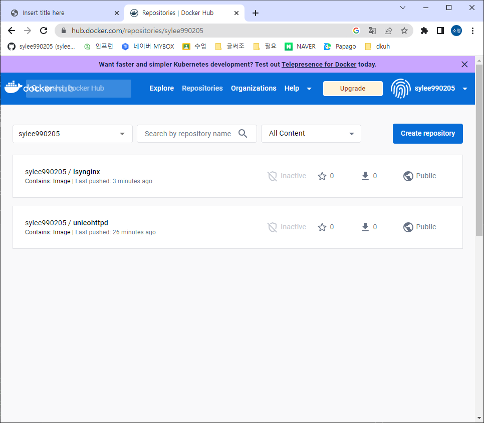
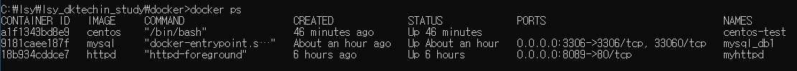
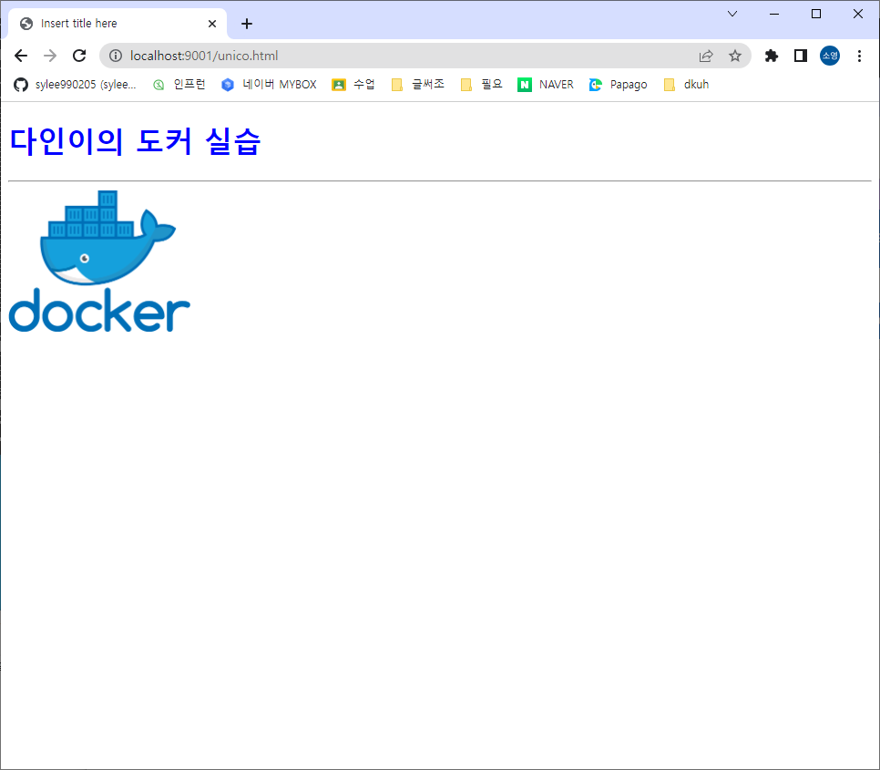

# 230614 docker exercise 01
1. 깃허브에 있는 nginx 이미지를 끌어와서 호스트 포트번호 9000, 컨테이너 포트번호 80으로
 컨테이너 이름은 영문이름이니셜nginx (예를 들어 강사의 경우 kjhnginx)으로 정한다.
 그리고 백그라운드 수행이 되도록 컨테이너를 기동시킨다.

2. 기동된 컨테이너 상태를 확인하는 명령을 수행시켜서 체크한다.

3. 기동된 nginx 서버 컨테이너의 쉘(/bin/bash) 환경을 기동한다.
 현재 디렉토리의 위치를 확인하고
 현재 디렉토리의 파일 리스트도 확인하고
 /usr/share/nginx/html
디렉토리로 옮겨간 다음 images 폴더를 생성한 다음
잘 만들어졌는지도 확인한다.
모든 작업을 마치면 쉘 환경을 종료한다.
4. 기동된 nginx 서버 컨테이너의 /usr/share/nginx/html/images 폴더에
docker.png 를 복사한다.
5. 다음 내용으로 구성된 unico.html 을 생성해서 기동된 nginx 서버 컨테이너의
/usr/share/nginx/html 폴더에 복사한다.
    ```html
    <!DOCTYPE html>
    <html>
    <head>
    <meta charset="UTF-8">
    <title>Insert title here</title>
    <style>
    h1 {
    color : blue;
    }
    </style>
    </head>
    <body>
    <h1>XXX의 도커 실습</h1>
    <hr>
    
    </body>
    </html>
    ```
6. 브라우저로 기동된 nginx 서버 컨테이너의 unico.html 을 요청해 본다

7. 영문이름이니셜nginx 명의 컨테이너에 기동된 이미지를 나의 레지스트리 즉 도커 허브에
 영문이름이니셜nginx 명 그리고 1.0 이라는 태그를 붙여서 저장한다.
본인 이름으로 변경

8. 추가로 생성된 이미지를 영문이름이니셜_docker.tar 파일로 저장한다.  
[:pushpin: lsy_docker.tar](/exercise/Docker%20exercise/lsy_docker.tar)
9. 영문이름이니셜nginx 명으로 기동된 컨테이너를 종료하고 삭제한다.

10. 앉은 자리에서 왼쪽 짝꿍이 올린 것을 도커허브에서 내려받아 컨테이너로 기동 시킨다.
 제일 왼쪽 줄에 앉은 친구들은 제일 오른쪽에 앉은 친구의 이미지로 진행한다.
 기동시 호스트 포트번호 9001, 컨테이버 포트번호 80으로 컨테이너 이름은
leftnginx 라고 지정하고 포그라운드로 기동시킨다.
